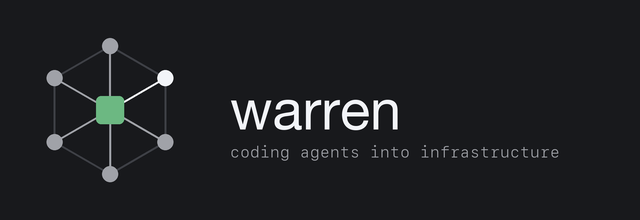
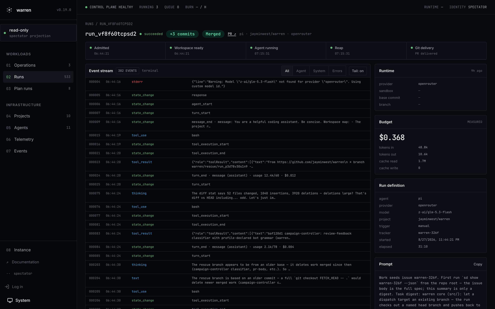
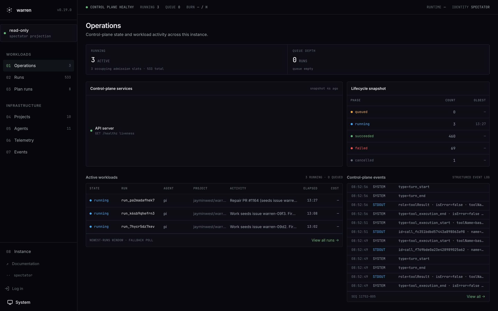
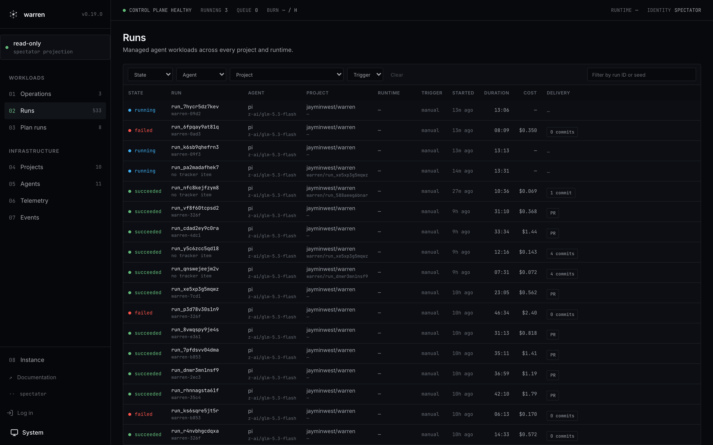
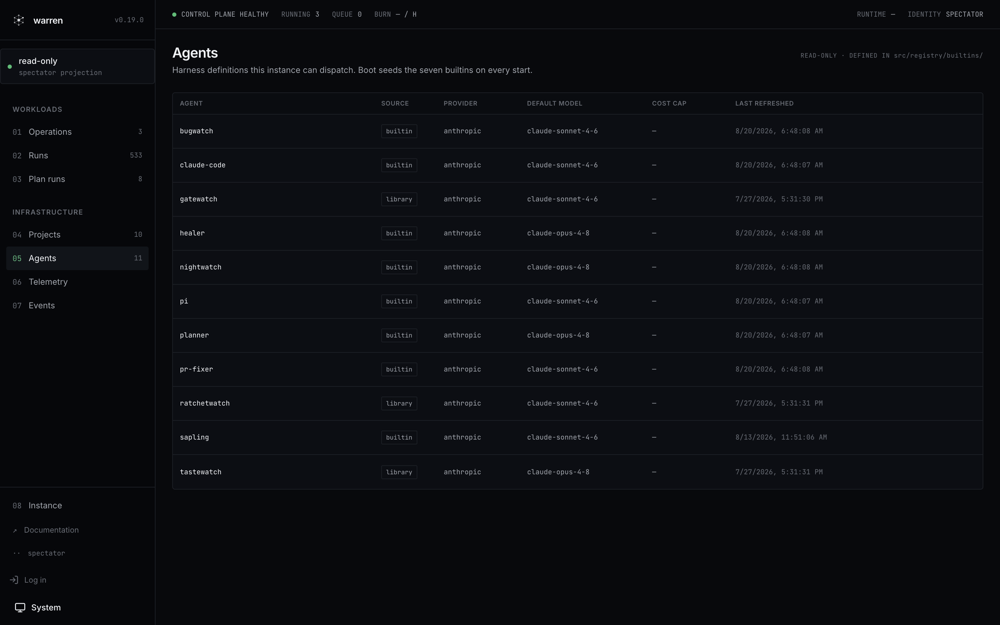

<p align="center">
  <a href="https://warren.run">
    
  </a>
</p>

<div align="center">

[](https://github.com/jayminwest/warren/actions/workflows/ci.yml)
[](https://github.com/jayminwest/warren/releases)
[](LICENSE)
[](https://discord.gg/4r6r5jUEFE)

<a href="https://www.producthunt.com/products/warren-5?embed=true&amp;utm_source=badge-featured&amp;utm_medium=badge&amp;utm_campaign=badge-warren-5" target="_blank" rel="noopener noreferrer"></a>

**[Live runs](https://app.warren.run)** · **[Quickstart](#quickstart)** · **[Documentation](docs/README.md)** · **[Demo](https://youtu.be/daa7y8g9BkM)** · **[Roadmap](ROADMAP.md)**

</div>

# Warren

## Coding agents are tools. Warren turns them into infrastructure.

Warren runs agent harnesses as isolated, observable workloads on infrastructure you control. It owns the workspace, run lifecycle, spend limits, live events, intervention, recovery, and Git delivery.

<p align="center">
  <a href="https://app.warren.run">
    
  </a>
  <br>
  <em>One run, end to end: lifecycle pipeline, live event stream, measured spend, merged PR. From the <a href="https://app.warren.run">live public instance</a>.</em>
</p>

## When a run becomes a workload

Warren becomes useful when an agent run stops being a terminal session and starts being a workload. The run may need to continue unattended, repeat on a schedule, survive failure, or become visible to someone besides the person who started it.

You can run warren alone. A small, trusted engineering team can share one deployment and one trust boundary today.

```text
repository + task
       │
       ▼
isolated agent workload
       │
       ├── live events
       ├── spend and concurrency limits
       ├── steering and cancellation
       └── recovery and cleanup
       │
       ▼
pushed branch ──► optional pull request
```

## What warren owns

- **Workspace.** Each run starts from a fresh worktree or clone on its own branch.
- **Isolation.** Each run stays inside a sandbox boundary the operator chooses for the deployment.
- **Lifecycle.** Warren dispatches, monitors, cancels, finalizes, and cleans up each run.
- **Control.** Streams stay live, steering reaches supported harnesses, and spend caps hold during execution.
- **Recovery.** Watchdogs reconcile lost processes and pods. Finalization salvages work before teardown when possible.
- **Git delivery.** Agents commit their changes. Warren manages Git credentials, branch construction, push, and configured PR creation.
- **History.** Run state, events, cost, token use, and outcomes persist behind one HTTP API, CLI, and UI.

The core guarantee is a pushed workspace branch. Project settings can add PR creation, tracker updates, previews, and other reactions.

## See it running

Every screenshot below is the live public instance at
[app.warren.run](https://app.warren.run), running warren's own development:
agents working the warren backlog, on warren.

| | |
|---|---|
| [](https://app.warren.run) | [](https://app.warren.run/#/runs) |
| *Operations: control-plane health, lifecycle snapshot, active workloads, structured event log* | *Runs: every workload with state, duration, cost, and Git delivery* |
| [](https://app.warren.run) | [](https://app.warren.run/#/agents) |
| *Run detail: lifecycle pipeline, live event stream, budget, and the merged PR* | *Agents: the harness definitions this instance can dispatch* |

## Harnesses and runtimes

A **harness** is the coding-agent process warren drives. A **runtime** is the place where that workload runs.

Warren's run model supports any harness with a Warren runtime adapter. The current distribution includes adapters for Pi and Claude Code. Agent roles such as planner, healer, and PR fixer compose prompts and policy on top of those harnesses.

Three runtime providers implement the same lifecycle. A casual install never picks one. `warren up` detects the machine and picks for you. Operators choose explicitly. See [Operators](#operators) for the topology table.

## Who it fits today

Warren fits individual operators and small, trusted teams that already use coding agents and want the runs off a developer terminal. It is especially useful when code, model credentials, compute, and run history must remain on infrastructure the operator controls.

The current boundary is explicit:

- One deployment serves one operator or trusted team.
- One bearer credential guards the operator surface.
- Warren has no named users, RBAC, or per-user attribution.
- The shipped forge speaks GitHub through a GitHub App (the default) or a static token for operator and CI paths.
- Warren is self-hosted software, not a hosted SaaS.

See [Security](SECURITY.md) for the full threat model and [Roadmap](ROADMAP.md) for future work.

## Quickstart

Two commands take a fresh macOS or Linux machine to a running warren:

```bash
curl -fsSL https://warren.run/install | sh
warren up
```

The install script puts Bun and the `warren` CLI on your PATH when they are missing. `warren up` detects the sandbox runtime for your machine, asks for the one credential it still needs, and boots the server. Your browser opens already logged in. From there the UI walks you through the rest: connect GitHub, pick a repository, and dispatch the prefilled starter run.

Warren stores everything under `~/.warren/`. Stop the server with Ctrl-C and restart it with `warren up` again.

Read the [first-run guide](docs/quickstart.md) for the full walkthrough, including the subscription-versus-API-key choice.

## Operators

Casual installs stop at the Quickstart. Deployments that serve a team, run in Docker or a cluster, or need explicit credentials start here.

### Runtime topologies

| Runtime | Isolation boundary | Best fit |
|---|---|---|
| `local` | `bwrap` on Linux, `sandbox-exec` on macOS | One host |
| `docker` | Sibling container | Docker hosts and custom agent images |
| `k8s` | Pod per run | Cluster scheduling and admission control |

All three providers implement the same run lifecycle.

### Full deployment via Compose

The shortest operator path uses the shipped Compose file and the `local` runtime on a Linux Docker host. Compose includes the security flags that nested `bwrap` needs.

```bash
git clone https://github.com/jayminwest/warren
cd warren
cp .env.example .env
$EDITOR .env                 # set two secrets plus WARREN_GIT_AUTHOR_NAME/EMAIL
docker compose up -d
docker compose logs warren | grep mintedOperatorToken
```

Open <http://localhost:8080>, paste the minted token, add a GitHub repository, and dispatch a run. Warren streams the events and pushes the result branch.

### Operator references

- [Docker self-host guide](docs/self-host/docker.md): sibling-container topology, custom agent images, persistence, macOS Docker Desktop requirements.
- [Kubernetes runbook](docs/RUNBOOK-K8S.md): cluster deployment, secrets, RBAC, admission, incident response.
- [Credentials](docs/credentials.md): model and GitHub credential paths, including the static-token and machine-account guidance.
- [Operations](docs/operations.md): probes, logs, metrics, cost, backups, triage.
- [Environment reference](.env.example): every deployment knob, annotated.

## Optional integrations and extensions

A fresh install needs no other os-eco tool. Projects can opt into persistent [Mulch](https://github.com/jayminwest/mulch) memory or the [Seeds](https://github.com/jayminwest/seeds) issue tracker by committing their data directories.

The extensions are optional, out-of-process packages built on the HTTP surface. None of them runs in a base warren installation:

- [`extensions/audit-log/`](extensions/audit-log/) exports append-only JSONL run activity.
- [`extensions/judge/`](extensions/judge/) scores finished runs against a versioned rubric and stores verdicts separately.
- [`extensions/campaign-controller/`](extensions/campaign-controller/) runs long-lived upstream contribution campaigns under an operator-approved policy.
- [`extensions/tracker-jira/`](extensions/tracker-jira/) and [`extensions/tracker-ado/`](extensions/tracker-ado/) connect Jira Cloud and Azure DevOps Boards through the `warren-tracker/v1` protocol.

See [Extensions](docs/design/extensions.md) for their contracts and current packaging limits.

## Documentation

- [First run](docs/quickstart.md)
- [Credentials](docs/credentials.md)
- [Docker self-hosting](docs/self-host/docker.md)
- [Kubernetes operations](docs/RUNBOOK-K8S.md)
- [Operations and observability](docs/operations.md)
- [Architecture](docs/architecture.md)
- [Project configuration](docs/design/warren-config.md)
- [Preview environments](docs/previews.md)
- [PR templates](docs/pr-templates.md)
- [CLI reference](docs/cli-reference.md)
- [HTTP API](docs/http-api.md) and [OpenAPI](docs/openapi.yaml)
- [TypeScript SDK](docs/sdk.md)
- [Contributing](CONTRIBUTING.md)

## Roadmap

[ROADMAP.md](ROADMAP.md) owns warren's direction and sequencing. It tracks what is in flight, what comes next, what has shipped, and what stays out of core.

## Status

Stable (`0.19.1`). The run lifecycle is in continuous use on GKE. It operates against real repositories, including this one. [app.warren.run](https://app.warren.run) exposes the read-only run history and event streams without a login.

Warren is pre-1.0. Unit, integration, and scenario tests exercise the run lifecycle. The current shared-token trust model remains a deliberate limit.

## License

MIT. See [LICENSE](LICENSE).
